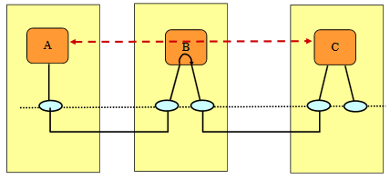
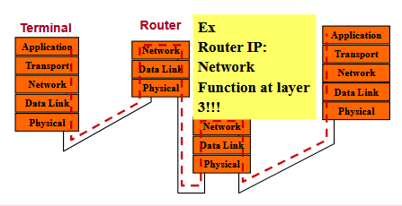

## 1.0 - Servizi di Comunicazione

Un **servizio di comunicazione** fornisce il trasferimento di informazioni tra due o più entità remote. Quando due entità (A e B) necessitano di comunicare, il servizio di comunicazione gestisce lo scambio di informazioni tra di loro, creando un canale di dialogo che le collega attraverso i rispettivi nodi.

Questi servizi possono essere descritti attraverso chiamate di servizio denominate **primitive di servizio**, che vengono utilizzate per:
- Descrivere il servizio
- Richiedere il servizio
- Raccogliere informazioni sul servizio

Le primitive di servizio sono caratterizzate da vari parametri:
- Il tipo di informazione da trasferire
- L'indirizzo di destinazione
- Le caratteristiche del servizio richiesto

#### Servizi Orientati alla Connessione
I servizi orientati alla connessione seguono tre fasi distinte:
1. **Instaurazione della connessione**: le entità stabiliscono un canale dedicato
2. **Trasferimento dati**: avviene lo scambio effettivo delle informazioni
3. **Rilascio della connessione**: il canale viene terminato al completamento dello scambio

#### Servizi Senza Connessione (Connectionless)
I servizi senza connessione:
- Non richiedono un'instaurazione preliminare della connessione
- Combinano tutte le fasi in un'unica operazione
- Operano in modo asincrono
- Non mantengono necessariamente una relazione tra diverse sessioni di trasferimento tra le stesse entità
- Presentano sfide nell'implementazione di servizi tipicamente orientati alla connessione (come VoIP)

## 1.1 - Architettura a Livelli

L'architettura di rete è organizzata in **livelli** (layer), dove entità dello stesso livello possono offrire un servizio di comunicazione alle entità del livello superiore o inferiore. Questa struttura permette di gestire la complessità dei sistemi di comunicazione.

Ogni livello implementa funzioni specifiche che arricchiscono il servizio offerto al livello superiore o inferiore. La comunicazione tra entità dello stesso livello (Tra dispositivi differenti) avviene attraverso **protocolli**.

#### Protocolli di Comunicazione

Un **protocollo** è un insieme di regole che gestiscono la comunicazione tra entità dello stesso livello. Definisce:
- Il formato dei messaggi
- Le informazioni sul servizio
- Le procedure di trasferimento delle informazioni

Le entità dello stesso livello si scambiano **Unità Dati di Protocollo** (PDU - Protocol Data Unit), che tipicamente comprendono:
- Un'intestazione (header): contiene informazioni di segnalazione
- Un carico utile (payload): contiene i dati ricevuti dai livelli superiori

#### Vantaggi dell'Architettura a Livelli

L'organizzazione a livelli offre numerosi benefici:
- **Riduzione della complessità**: scompone problemi complessi in componenti gestibili
- **Interfacce standardizzate**: facilita l'interoperabilità tra sistemi diversi
- **Modularità**: consente di modificare l'implementazione di un livello senza influenzare gli altri
- **Facilità di insegnamento e comprensione**: permette di studiare la rete per componenti
- **Manutenzione semplificata**: permette aggiornamenti trasparenti al resto del sistema

#### Interfacce tra Livelli

L'interfaccia tra livelli è caratterizzata da **Punti di Accesso al Servizio** (SAP - Service Access Point). Attraverso questi punti:
- Il livello N offre servizi al livello N+1
- Il livello N+1 passa le PDU al livello N
- Il livello N aggiunge informazioni di controllo del protocollo (PCI - Protocol Control Information) alle unità dati di servizio (SDU - Service Data Unit) ricevute dal livello superiore

Il livello più basso è il livello **Fisico**, che gestisce il flusso di bit attraverso mezzi fisici come cavi o onde radio. Il SAP del livello fisico è una porta fisica.

## 1.2 - Funzioni di Rete

### Routing e Indirizzamento
Poiché un'entità può comunicare con più entità dello stesso livello, sono necessarie funzionalità di routing per selezionare il SAP appropriato (i router e gli switch hanno diverse interfacce di rete a livello fisico per esempio). Il routing viene effettuato utilizzando **indirizzi**:
- L'indirizzo identifica il SAP di destinazione (interfaccia di destinazione)
- Può essere unicast (singolo SAP), multicast (gruppo di SAP), broadcast (tutti i SAP) o anycast.
- L'indirizzo viene inserito nella PDU per permettere il routing successivo se necessario.

### Inoltro (Forwarding)
Una volta scelto il SAP, la PDU deve essere inoltrata. La scelta del SAP di uscita avviene sulla base delle **tabelle di routing**, che contengono informazioni raccolte attraverso protocolli di routing.

## 1.7 - Percorsi verso la Destinazione

Il routing può avvenire a diversi livelli dell'architettura:

1. **Router IP**: implementa funzioni di rete a livello 3 (livello di rete)
2. **Switch LAN**: implementa funzioni di rete a livello 2 (livello di collegamento dati)
3. **Proxy**: implementa funzioni di rete a livello applicativo (livello 5)

In una rete tipica, i nodi intermedi (come i router) elaborano i pacchetti fino al livello di rete, mentre i nodi terminali (come i computer) elaborano i pacchetti fino al livello applicativo.

- *Router*: layer 3 (Transport)
- *Switch*: layer 2/3 (Data-Link / Transport)
- *Devices like PC*: layer 7 (Application)

L'architettura a livelli consente quindi una gestione efficiente e modulare della complessità delle reti moderne, permettendo l'implementazione di servizi di comunicazione sofisticati attraverso una struttura ben organizzata di protocolli e interfacce.