# Canali e Multiplexing nelle Reti Cellulari

## 2.1 - Canali Point-to-Point

I canali point-to-point sono connessioni permanenti tra un mittente e un ricevitore. Questi canali presentano diversi vantaggi: il ricevitore può essere progettato e ottimizzato specificamente per il segnale che deve ricevere, essendo l'unico destinatario della comunicazione. La trasmissione dei dati può avvenire in modo continuo oppure suddivisa in frame, sebbene quest'ultima modalità comporti potenziali problemi di sincronizzazione tra mittente e ricevitore.

## 2.2 - Canali Broadcast

Nei canali broadcast, più stazioni o nodi possono accedere al canale in parallelo, condividendolo tra tutti i partecipanti. La peculiarità di questi canali è che la trasmissione di una stazione raggiunge tutte le altre stazioni connesse.

Il ricevitore in un canale broadcast si trova ad affrontare sfide particolari: deve essere in grado di ricevere diverse trasmissioni che differiscono per livello di potenza e sincronizzazione, adattandosi a queste differenze e isolando la trasmissione corretta. Per facilitare questo processo, le trasmissioni solitamente iniziano con un preambolo (carattere di sincronizzazione) per stabilire la sincronizzazione. Esempi di sistemi che utilizzano canali broadcast includono le reti locali Ethernet e i sistemi cellulari.

## 2.3 - Multiplexing

Il multiplexing è una tecnica (astrazione) che consente di suddividere la capacità fisica di un canale per ottenere più sottocanali con velocità inferiori. Attraverso questa tecnica, un singolo mezzo di trasmissione può supportare multiple comunicazioni simultanee.

### Multiplexing Fisico

Nel multiplexing fisico (ovvero l'applicazione reale della definizione astratta del multiplexing), ogni sottocanale è definito esclusivamente sulla base di parametri fisici, come frequenza, tempo, codice, lunghezza d'onda, ecc. Questo approccio opera al livello fisico del modello di rete, dove un multiplexer suddivide il canale in sottocanali che vengono poi riassemblati da un demultiplexer sul lato ricevente.

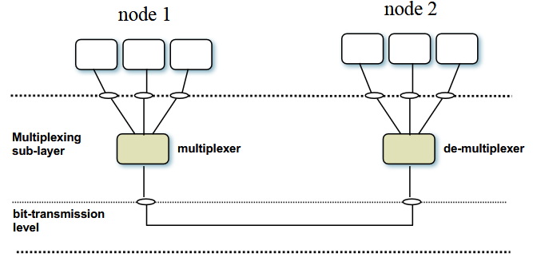

## 2.4 - FDM (Frequency Division Multiplexing)

Il Frequency Division Multiplexing (FDM) è una tecnica basata sulla suddivisione della larghezza di banda disponibile di un canale fisico. Ogni canale fisico è caratterizzato dalla sua larghezza di banda disponibile (l'insieme delle frequenze disponibili per la trasmissione, da fₘᵢₙ a fₘₐₓ). Questa larghezza di banda viene divisa in sottocanali (porzioni di frequenza), e a ciascun sottocanale viene associata una comunicazione.

Nel processo FDM, il segnale relativo a una comunicazione viene filtrato e poi modulato (quindi, spostato in frequenza) per adattarsi esattamente al sottocanle creato. Questo permette a più segnali di condividere lo stesso mezzo di trasmissione senza interferire tra loro --> ogni canale corrisponde ad una porzione di frequenze, successivamente al canale si trova una banda di guardia e poi il canale successivo, costituito a sua volta da un'altra fascia di freqeunze.

La struttura di un sistema FDM comprende:
- bₛ = larghezza di banda del segnale
- bₑ = banda di guardia
- B = larghezza di banda totale disponibile (fₘₐₓ - fₘᵢₙ)

La relazione tra questi parametri è data da: B = n × (bₛ + bₑ), dove n è il numero di sottocanali.

### FDM nella Telefonia

Storicamente, l'FDM è stato utilizzato come tecnica di multiplexing per trasmettere chiamate vocali tra centrali telefoniche. La larghezza di banda di una chiamata vocale è approssimativamente di 4 kHz (da 300 Hz a 3600 Hz). In questo contesto, 12 canali/chiamate vocali di 4 kHz ciascuno venivano multiplexati su una larghezza di banda totale di 48 kHz (nell'intervallo tra 60 e 108 kHz). Successivamente, questa aggregazione di 48 kHz veniva ulteriormente multiplexata in aggregazioni ancora più grandi, secondo uno schema di modulazione gerarchico.

## 2.5 - TDM (Time Division Multiplexing)

Il Time Division Multiplexing (TDM) è una tecnica utilizzata principalmente per segnali digitali/binari (sequenze di 0 e 1). Dato un canale con velocità/capacità C (bit/s), vengono definiti intervalli di tempo (denominati slot), la cui durata è un multiplo della durata del bit tᵦ = 1/C.

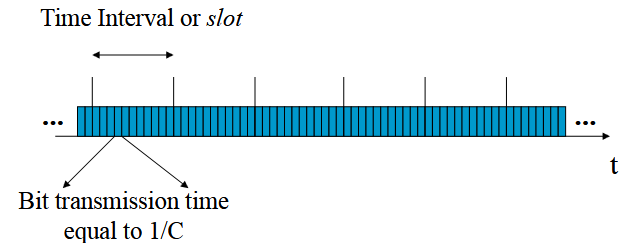

Nel TDM, ogni sorgente/mittente può utilizzare un solo slot temporale ogni N slot. Viene quindi definita una struttura a frame, dove il frame è costituito da N slot temporali consecutivi. A ciascuno slot temporale viene assegnato un numero, e ogni sorgente/mittente è associato a un numero di slot temporale, potendo trasmettere solo all'interno di quello slot.

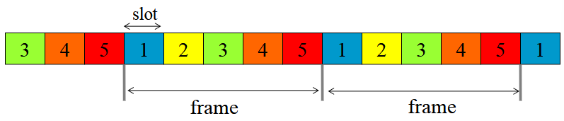

La struttura di un sistema TDM è caratterizzata da:
- Durata del frame: T = N × nᵢ / C
- Numero di bit per slot: nᵢ
- Durata dello slot: Tᵢ = nᵢ / C
- Velocità/capacità di ciascun sottocanale: c = C / N (bit/s)

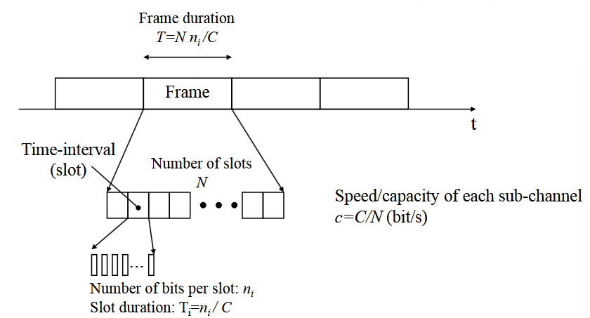

È importante notare che ogni sorgente/mittente produce bit esattamente con velocità c. I nᵢ bit che si adattano allo slot devono essere già disponibili quando lo slot inizia. Chiaramente, la sorgente necessita di nᵢ/c secondi per produrre e accumulare i nᵢ bit.

La scelta della durata dello slot è molto importante (questo è un parametro scelto quando viene progettato il sistema a slot). La capacità/velocità del sottocanale c non dipende da Tᵢ ma solo da N (c = C / N).

### TDM/TDMA: Canali a diverse velocità

Se a ciascun sottocanale viene assegnato un singolo slot per frame, tutte le velocità di trasmissione sono uguali. In molti casi, però, è necessario multiplexare canali con velocità diverse. A questo scopo, è possibile utilizzare frame più complessi in cui a un canale possono essere assegnati più di uno slot.

Per semplicità, questo viene solitamente ottenuto utilizzando una gerarchia di frame, con frame e super-frame. Ad esempio:
- Canale A = slot 1 in ogni frame (C/5)
- Canale B = slot 2 solo nei frame dispari (C/10)
- Canale C = slot 2 solo nei frame 1 e 5 (C/20)

## 2.6 - CDM (Code Division Multiplexing)

La tecnica CDM consiste nel miscelare (cioè, sommare) N flussi di bit (N trasmissioni), subito dopo averli moltiplicati ciascuno con una parola di codice Cᵢ scelta tra le N parole di codice di un codice ortogonale. Le parole di codice sono costituite da N simboli binari, chiamati chip per distinguerli dai bit, la cui durata è N volte più breve di un bit.

### Codici Ortogonali

I codici ortogonali sono sequenze che soddisfano la proprietà di ortogonalità, espressa matematicamente come l'integrale del prodotto di due segnali o sequenze che risulta uguale a zero. Una famiglia di codici ortogonali comunemente utilizzata è rappresentata dalle matrici di Hadamard.

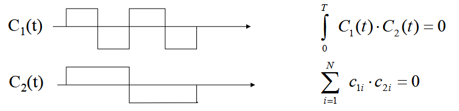

Ad esempio, per N=4, i codici ortogonali sono:
- C₀ = {1, 1, 1, 1}
- C₁ = {1, -1, 1, -1}
- C₂ = {1, 1, -1, -1}
- C₃ = {1, -1, -1, 1}

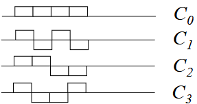

Nella multiplazione a divisione di codice, il codice "espande" la larghezza di banda radio del segnale, permettendo a diversi segnali di utilizzare la stessa banda radio.

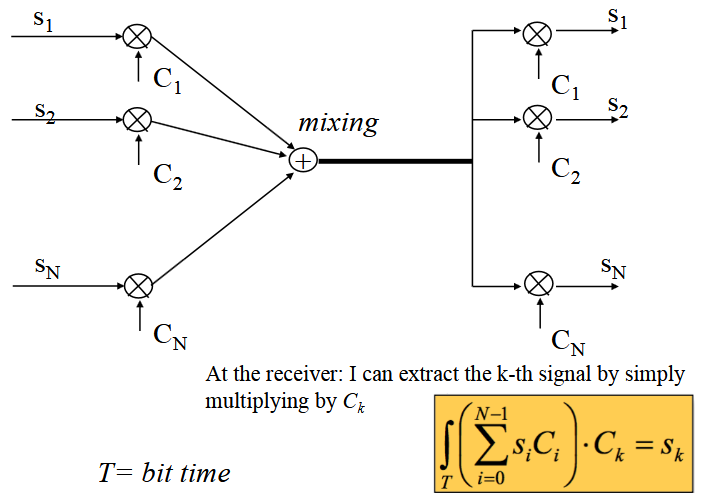

### CDMA (Code Division Multiple Access)
CDMA (Code Division Multiple Access) è un caso specifico di CDM, usato nei sistemi di telecomunicazione per permettere a più utenti di accedere simultaneamente a un canale senza interferenze significative.

Il segnale dell’utente viene moltiplicato per un codice pseudo-casuale (PN) ad alta velocità (chiamata chip rate).
-  Se il codice è lungo, il segnale viene spalmato su una banda più larga.
-  Il codice è ortogonale rispetto agli altri utenti, evitando interferenze.

A questo punto il segnale "spalmato" viene trasmesso nell’etere sulla stessa frequenza di altri utenti, generando un segnale complessivo che sembra rumore.

## 2.7 - WDM (Wavelength Division Multiplexing)

Il Wavelength Division Multiplexing (WDM) è simile all'FDM; viene chiamato WDM per ragioni storiche, legate allo sviluppo delle fibre ottiche. Diverse segnali vengono modulati utilizzando diverse lunghezze d'onda su fibre ottiche. Ogni lunghezza d'onda può trasportare enormi quantità di informazioni (5-10 Gbit/s).

Il limite tecnologico è legato alla stabilità dei LED/Laser utilizzati per modulare i segnali, nonché dalla precisione dei filtri ottici. Attualmente esistono dispositivi commerciali con 16 - 128 lunghezze d'onda (Dense WDM, DWDM).

## 2.8 - Accesso Multiplo

L'accesso multiplo è simile al multiplexing, ma concettualmente è molto diverso. Infatti, l'accesso multiplo è legato ai canali broadcast. Quindi, le stazioni/nodi che accedono al canale broadcast sono distanti, quindi si trovano fisicamente in luoghi diversi, possibilmente molto lontani l'uno dall'altro, e quindi hanno bisogno di coordinarsi tra loro per accedere al canale senza collisioni!

### FDMA (Frequency Division Multiple Access)

L'FDMA è analogo all'FDM. Stazioni/nodi diversi devono coordinarsi per accedere al canale, ma questo non è un problema con l'FDMA. Esempi di utilizzo includono:
1. la trasmissione di stazioni TV o radio 
2. il sistema cellulare TACS (Total Access Cellular System) che utilizzava sottocanali da 25 kHz per le chiamate telefoniche.

### TDMA (Time Division Multiple Access)

L'accesso multiplo a divisione di tempo (TDMA) è simile al TDM, ma richiede che le stazioni si coordinino tra loro per trovare un riferimento temporale comune (necessario per sapere quando iniziano e finiscono gli slot/frame). Poiché la sincronizzazione non può essere perfetta, sono necessari tempi di guardia per evitare sovrapposizioni.
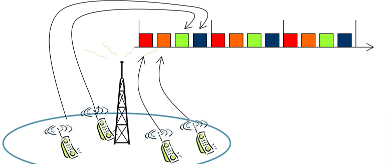

## 2.9 - Canali Broadcast Centralizzati e Distribuiti

I canali broadcast possono essere classificati in base alla loro architettura:

1. **Canali Broadcast Centralizzati**: Questi canali hanno un punto di accesso fisso (sistemi cellulari, WLAN, WMAN) che gestisce le connessioni con i dispositivi mobili. La copertura cellulare si ottiene mediante stazioni base (BS) o punti di accesso che forniscono accesso radio alle stazioni mobili (MS) all'interno di un'area di servizio chiamata cella.
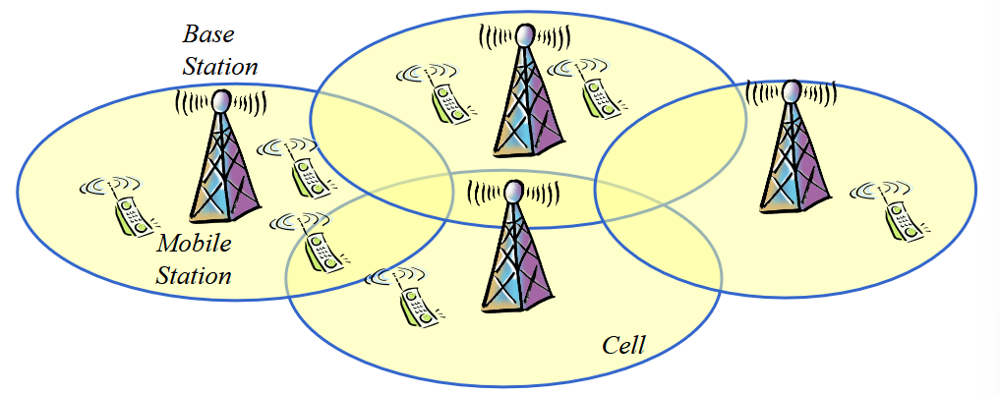

2. **Canali Broadcast Distribuiti**: Nei canali broadcast distribuiti, come le reti wireless ad-hoc (reti mesh, reti di sensori), le connessioni avvengono direttamente tra dispositivi mobili. In operazioni multi-hop, le stazioni mobili possono inoltrare informazioni, fungendo da relay tra la sorgente e la destinazione.

## 2.10 - Sincronizzazione nei Canali Broadcast Centralizzati

Nei canali broadcast centralizzati, la stazione base è fondamentale per garantire la sincronizzazione tra i terminali mobili. Le sue trasmissioni vengono utilizzate per sincronizzare tutte le trasmissioni (ad esempio, inviando un segnale per indicare quando inizia il frame).

### Tempo di Guardia

A causa dei diversi tempi di propagazione tra la stazione base e i vari terminali mobili, è necessario inserire un tempo di guardia per evitare collisioni tra le trasmissioni. Il tempo di guardia è definito come il doppio del massimo tempo di propagazione tra la stazione base e il terminale più lontano: Tg = 2 × max(τi)

Ovviamente, il tempo di guardia è dominato dal nodo più lontano dalla BS.

### Timing Advance

Per ottimizzare l'uso del canale, si può utilizzare la tecnica del Timing Advance: se ogni nodo conosce il ritardo di propagazione verso la BS, può anticipare la sua trasmissione! Il ritardo di propagazione τ deve essere stimato (può variare nel tempo). L'errore di stima è ancora possibile: i tempi di guardia sono ridotti, ma non sono nulli! Questa tecnica è utilizzata nel sistema GSM.

### Efficiency
Diepnde srattamente dal ratio Tg/Ti. dove Ti altrono non è che lo slot di trasmissione meno la banda di guardia, mentre Tg è la banda di guardia stessa.
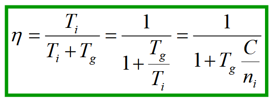

## 2.11 - Sistemi Cellulari Mobili

I sistemi cellulari mobili si sono evoluti attraverso diverse generazioni, ciascuna con caratteristiche e tecnologie di accesso radio distintive. Possiamo vedere 2 tipi di comunicazione:
1. UpLink: si ha Accesso Multiplo dai MS (Mobile Stations) alla BS (Base Station).
2. DownLink: si ha multiplexing dalla BS veso le MS.

#### Prima Generazione (1G)
- TACS (Europa)
- AMPS (Stati Uniti)
- Utilizzava FDM/FDMA (downlink/uplink)

#### Seconda Generazione (2G)
- GSM (Europa e poi mondiale)
- D-AMPS (Stati Uniti)
- Multi-carrier TDM/TDMA
- 
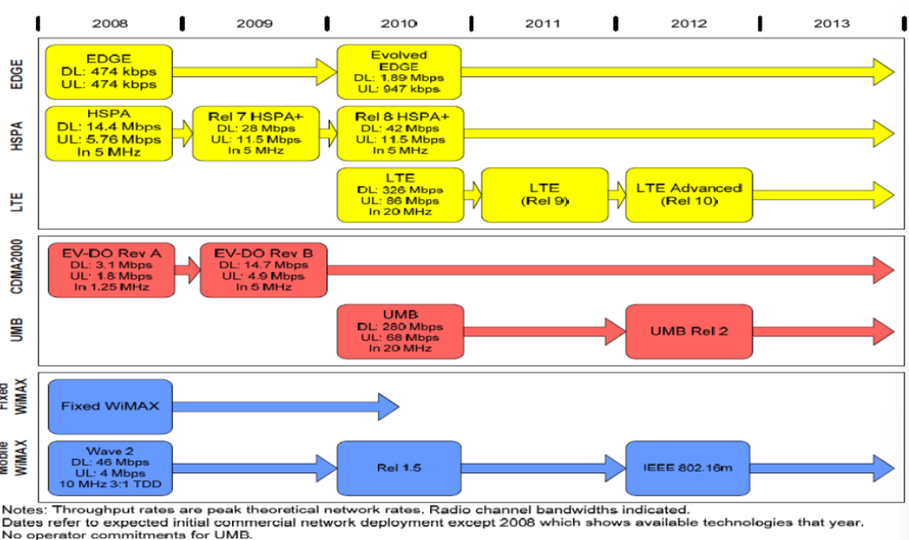

#### Terza Generazione (3G)
- UMTS
- Utilizzava CDM/CDMA
- HSPA (High Speed Packet Access, nota anche come 3.5G)

#### Quarta Generazione (4G)
- LTE (Long Term Evolution)

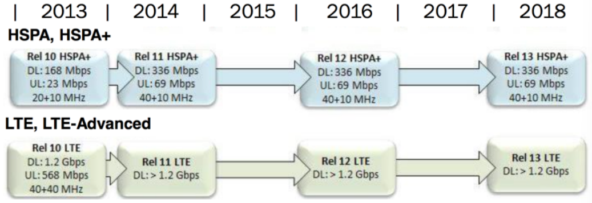

## 2.12 - Riuso di Frequenza

Il riuso di frequenza nasce da un problema fondamentale: le frequenze disponibili non sono sufficienti per tutti gli utenti. La soluzione è riutilizzare le stesse frequenze in celle diverse attraverso il riuso spaziale. Nella pratica questa tecnica consiste nel riutiulizzare la stessa banda di frequenze utlizzata nella comunicazione BS-MS con una seconda coppia BS-MS a un certo numero di KM di distanza.

### Interferenza Co-Canale

Il riuso spaziale causa inevitabilmente l'interferenza co-canale. Questa interferenza è una caratteristica intrinseca dei sistemi cellulari. Generalmente, si considera che la qualità del sistema sia buona quando il rapporto tra la potenza del segnale e la potenza di interferenza (Signal-to-Interference Ratio, SIR) è superiore a una soglia predefinita.

### Forma delle Celle

Tradizionalmente, per descrivere in modo semplificato la struttura dei sistemi cellulari, le celle vengono rappresentate con forma esagonale. Sebbene nella realtà la forma delle celle sia molto più irregolare a causa della posizione delle stazioni base e delle caratteristiche di propagazione dei segnali, la rappresentazione esagonale è un buon approccio per dimensionare il sistema e comprenderne i principi base.

### Dimensionamento del Cluster

Il processo di dimensionamento del cluster prevede:

1. Suddividere tutte le frequenze disponibili in K gruppi
2. Assegnare un gruppo a ogni cella massimizzando la distanza tra celle che utilizzano lo stesso gruppo di frequenze

L'efficienza del riuso di frequenza è pari a 1/K. I valori possibili per K includono: 1, 3, 4, 7, 9, 12, 13, ecc.

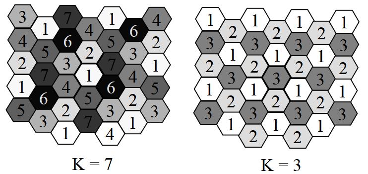

$$
P_r= \frac{P_t \cdot G}{D_m}
$$

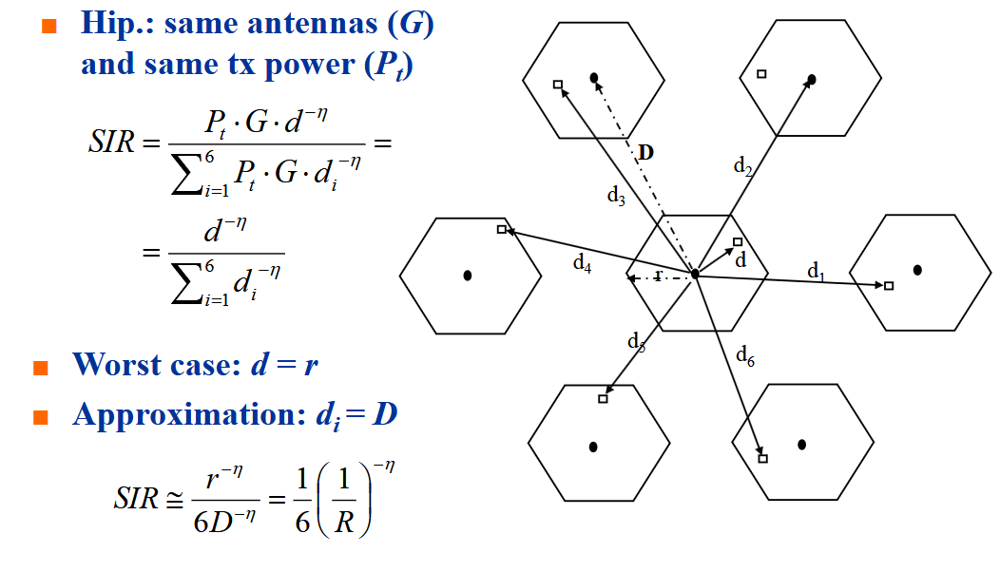

in base al numero K la distanza tra celle che utilizzano lo stesso set di frequenze cambia (mentre rimane inveriato il "raggio" degli esagoni)

### Calcolo del SIR (Signal-to-Interference Ratio)

Il dimensionamento dipende dalla stima del valore minimo di SIR tollerato dal sistema. Alcuni fattori chiave nel calcolo includono:
- Potenza ricevuta
- Esponente di perdita di percorso
- Distanze tra celle

Da cui possiamo dedurre:
$K_min=\frac{(6SIR)^{2/η}}{3}$
Approssimato al numero di K successivo possibile.
### Considerazioni sul Dimensionamento

Nel modello di dimensionamento vengono fatte diverse semplificazioni:
- Considerazione delle sole distanze
- Valutazione solo del primo anello di interferenti
- Assenza di rumore termico
- Considerazione della sola perdita di percorso

L'obiettivo è garantire un buon SIR a tutti gli utenti, considerando i casi più critici.

## 2.13 - Antenne Settoriali
L'uso di antenne direttive permette di modificare il layout cellulare e ridurre l'interferenza ricevuta. Nei sistemi cellulari, è comune l'uso di antenne con un angolo principale di 120°.

### Vincoli di Assegnazione

L'assegnazione dei canali è soggetta a vincoli aggiuntivi:
- Le frequenze adiacenti possono generare interferenze reciproche
- Le celle dello stesso sito non possono utilizzare frequenze adiacenti
- I lobi secondari delle antenne possono generare interferenze nelle celle vicine

## 2.14 - Layout Cellulari

Un'osservazione importante è che la formula semplificata per il dimensionamento del cluster non dipende dal raggio della cella, ma solo dai rapporti di distanza. Questo offre la libertà di pianificare il layout cellulare (dimensioni delle celle) in base alla densità di traffico stimata in diverse aree.
