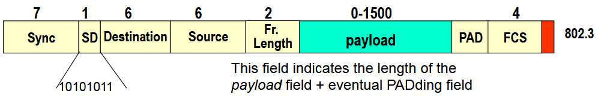
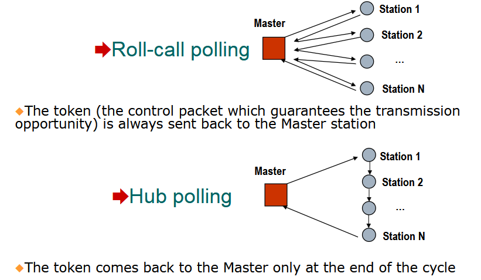
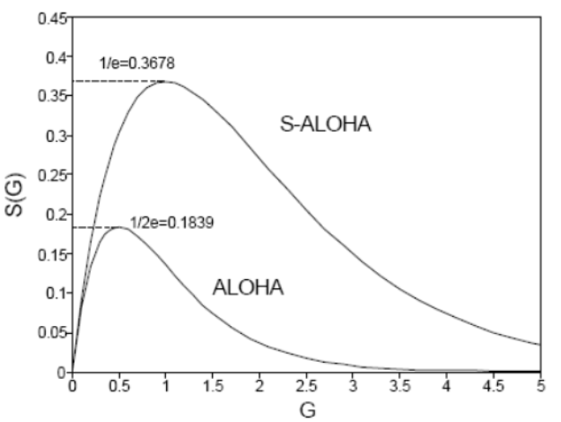
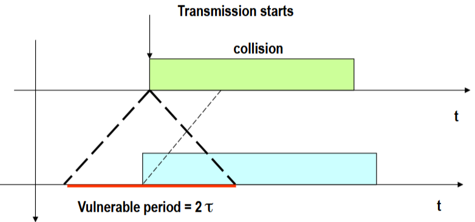
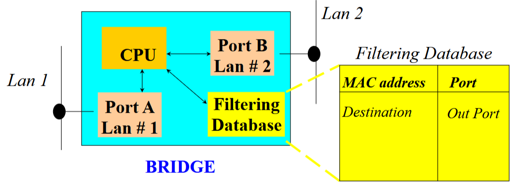
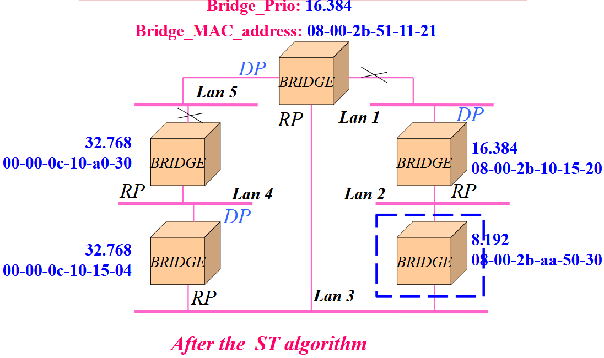
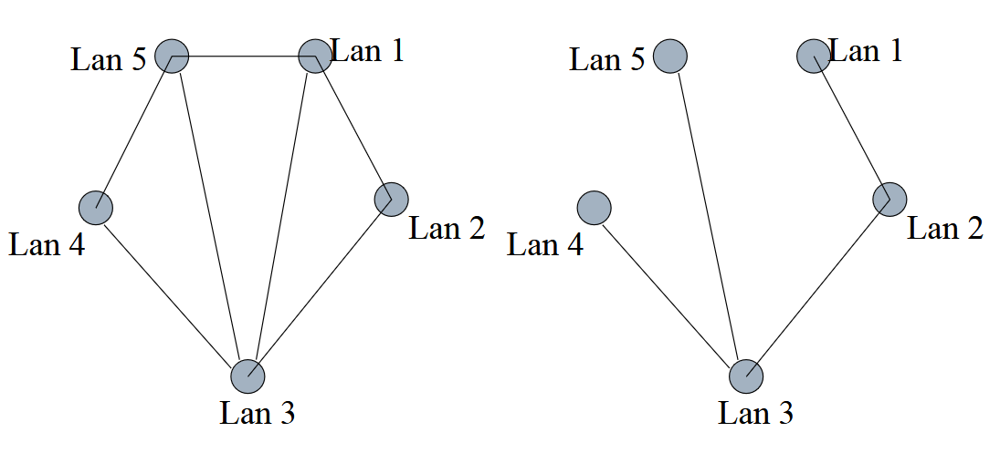

# Access Technologies

## 3.1 - LAN Ethernet - IEEE 802.3

#### IEEE 802 Working Group

| Data Link Layer | Physical Layer | Medium Access Control |
|---------------|---------------|------------------------|
| 802.3 (Ethernet) | 802.5 (Token Ring) | 802.11 (WiFi) |
| 802.2 (LLC) | 802.1 (Interconnessione LAN) | |

#### Indirizzamento in un mezzo broadcast

L'indirizzamento in una rete broadcast consente a più dispositivi di ricevere lo stesso segnale simultaneamente. Questo tipo di topologia può essere gestito tramite differenti configurazioni.

- **Topologia a stella**: Utilizza uno switch per collegare tutte le stazioni di rete.
- **Topologia a bus (storica)**: Tutti i dispositivi sono connessi a un unico cavo condiviso.

#### Frame IEEE 802.3 (Ethernet Frame)

  

- **Lunghezza minima del frame**: 512 bit (1 slot), pari a 51,2 µs
- **Velocità di propagazione**: 2 × 10⁸ m/s (~5 µs/km)
- **Diametro massimo della LAN**: 2,5 km

#### Differenze tra IEEE 802.3 ed Ethernet

- **IEEE 802.3** utilizza il livello LLC (802.2) sopra il MAC
- **Ethernet** è direttamente collegato al livello di rete (IP)
- **Identificazione protocolli**:
  - In 802.3: lunghezza del frame (≤1500)
  - In Ethernet: codice protocollo (>1536 o 0x0600 in hex)

## 3.2 - Protocolli di accesso al mezzo

Problema: Se più stazioni trasmettono contemporaneamente, si verificano collisioni.

Soluzione: Definire protocolli per controllare l'accesso al mezzo broadcast e gestire le collisioni.

1. **Accesso ordinato**
   - TDMA (Time Division Multiple Access)
   - Round Robin
   - Polling (Roll Call, Hub Polling)
2. **Accesso casuale**
   - CSMA/CD (Ethernet)
   - CSMA/CA (WiFi)

#### Esempio di TDMA

- Inefficiente per le LAN a traffico variabile
- Introduce alti ritardi e riduce la capacità di throughput

#### Esempio di Round Robin

- Ogni stazione ha la possibilità di trasmettere in un turno
- Se non ha dati, passa il turno alla successiva
- Se ha dati, trasmette fino a un massimo definito (K)
Il master non è per forza un dispositivo speciale, semplicemente è colui che si occupa di distribuire il tokens.

  

#### Accesso casuale
In questi protocolli non esiste un sistema che organizzi l'accesso al mezzo per i dispositivi connessi alla rete.

**Slotted Aloha:**
- Tempo diviso in slot
- Le stazioni trasmettono nel primo slot disponibile
- In caso di collisione, ritentano dopo un tempo casuale

**Aloha:**
- Non ho la suddivisione in slot
- Quando voglio trasmetto
  
Non essendoci nessun meccaniscmo di controllo prima dell'invio, è frequente la presenza di collisioni nel mezzo. Possiamo vederlo come un problema di poisson con rate pari a $\lambda$, definiamo quindi il throughput come:

$$
S= Ge^{-2G}
$$

dedotto dal fatto che la probabilità di successo è pari alla probabilità che non avvenga nessuna comunicazione in $2T$:

$$
P_s= e^{-2G}
$$

  

#### CSMA/CD (Carrier Sense Multiple Access with Collision Detection)
CSMA è stato creato per supportare la lettura del mezzo prima della trasmizzione.

  

1. Ascolto del canale prima di trasmettere
2. Se il canale è occupato, si attende
3. Se avviene una collisione, la trasmissione viene interrotta (*Collision Detection*). La trasmissione vene abortita e vengono trasmessi 32 bit detti di *jamming*.
4. Ritrasmissione dopo un tempo casuale (*Backoff esponenziale*)
5. Dopo 16 tentativi falliti, il frame viene scartato

## 3.3 - Interconnessione delle LAN

I principali dispositivi che si occupano di interconnettere le reti sono:
- **Repeater**: Estende il segnale fisico, trasmette bit
- **Bridge**: Filtra e inoltra i frame in base agli indirizzi MAC

#### Bridge e forwarding

- Utilizza un database di inoltro (FDB)
- Apprendimento all'indietro (Backward Learning):
  - Registra la porta di provenienza dei frame
  - Se la destinazione è nota, inoltra solo su quella porta
  - Se sconosciuta, inoltra su tutte le porte eccetto quella di ingresso

  

## 3.4 - Broadcast Storm e Spanning Tree Protocol (STP)

### Problema delle tempeste di broadcast
Quanto visto fino ad ora prevede la sola esistenza di reti ad albero, se venissero introdotti cicli all'interno della rete, cio provocherebbe loop di forward infiniti dei pacchetti on caso fossero broadcast => I frame di broadcast si propagano indefinitamente tra i bridge.

### Algoritmo Spanning Tree
STP permette di ottenere una topologia logica ad albero (tree) da una rete fisicamente mesh, bloccando alcuni collegamenti.

1. **Selezione del Root Bridge**
  Ogni bridge ha un Bridge ID (composto da una priorità di 16 bit e un MAC Address di 48 bit). Il bridge con il Bridge ID più basso viene eletto Root Bridge.

2. **Selezione delle porte**
  - Ogni bridge calcola il percorso più breve (con il minor costo) per raggiungere il Root Bridge. 
  - Il Root Port (RP) è la porta con il percorso più corto verso il Root Bridge.
  - Ogni LAN sceglie un Designated Bridge, il bridge con il percorso più breve verso il Root Bridge.
  - La porta che collega il Designated Bridge alla LAN è chiamata Designated Port (DP).

3. **Blocco delle porte non necessarie**
  Le porte non designate vengono bloccate per evitare loop, mantenendo attive solo Root Port e Designated Port.

  
  

Si ottiene cosi un albero da una struttra inizialmente Mesh.