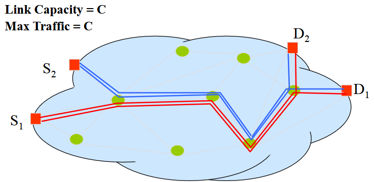
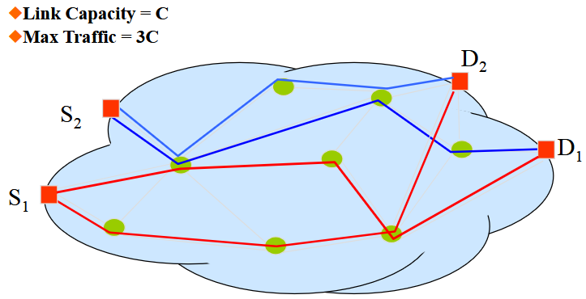

# Routing Protocols e Algoritmi di Routing

## 5.0 - Come Instradare i Pacchetti

Il routing è una funzionalità fondamentale nelle reti di telecomunicazioni, soprattutto nelle reti TCP/IP. Esso permette la comunicazione tra due nodi A e B che non sono direttamente connessi tra loro. Le entità di livello 3 lungo il percorso instradano i pacchetti in base all'indirizzo di destinazione, consultando le tabelle di routing che contengono la corrispondenza tra l'indirizzo di destinazione e l'interfaccia di uscita (SAP - Service Access Point).

Un protocollo di routing comprende due funzionalità principali:
1. Lo scambio di informazioni sulla topologia della rete e sul traffico
2. La creazione e la manutenzione delle tabelle di routing

In pratica, queste due fasi sono strettamente correlate: il modo in cui vengono create le tabelle di routing dipende dallo scambio di messaggi di routing e viceversa.

  

#### Algoritmi di Routing

Un algoritmo di routing definisce i criteri per scegliere un percorso tra una sorgente e una destinazione, e costruisce le tabelle di routing. I criteri di scelta dipendono dal tipo di rete (datagramma o circuito virtuale).

Il routing ha un impatto profondo sulla capacità della rete. In reti broadcast non c'è bisogno di routing, quindi il traffico massimo supportato dipende dalla capacità del canale. Nelle reti mesh IP, invece, più collegamenti possono essere utilizzati contemporaneamente, quindi quali collegamenti vengono utilizzati ha un impatto profondo sulla capacità della rete.

  

  

Una pianificazione intelligente del routing può aumentare significativamente la capacità della rete rispetto a una pianificazione poco efficiente.

---

## 5.1 - Routing in Internet

Nelle reti IP, l'inoltro dei pacchetti è basato sulla destinazione e sul next-hop. Ciò significa che tutti i pacchetti destinati a D che arrivano al router R seguono lo stesso percorso dopo R. (?)

  

Questo impone alcuni vincoli sul routing:
- Tutti i percorsi da tutte le sorgenti a una destinazione D devono formare un albero
- Le coppie sorgente-destinazione non possono essere instradate indipendentemente da altre coppie

Nel routing TCP/IP viene scelto il percorso più breve verso una destinazione. Il calcolo del percorso più breve viene eseguito sul grafo che rappresenta la rete (dispositivo=vertice, collegamento=arco, peso dell'arco=metrica).

Le proprietà del percorso più breve sono:
- Tutti i percorsi verso una destinazione formano un albero
- Gli algoritmi sono semplici e facili (complessità polinomiale, anche distribuiti)

 

### Teoria dei Grafi e Algoritmi di Percorso Minimo

Un grafo orientato G(N,A) è composto da N nodi e A archi (coppie ordinate di nodi). Un percorso è un insieme di nodi senza ripetizioni, mentre un ciclo è un percorso in cui il primo e l'ultimo nodo coincidono.

Un grafo orientato connesso è un grafo in cui esiste almeno un percorso tra qualsiasi coppia di nodi. Un grafo pesato associa ad ogni arco un peso.

La lunghezza di un percorso è la somma dei pesi degli archi che lo compongono.

Il problema del percorso minimo ha complessità polinomiale nel numero di nodi. Una proprietà importante è che se un nodo k è attraversato dal percorso minimo da i a j, anche il percorso da i a k è il percorso minimo.

#### Algoritmo di Bellman-Ford

L'algoritmo di Bellman-Ford trova i percorsi minimi da una sorgente a tutti gli altri nodi. Funziona anche con pesi negativi, ma non con cicli negativi.

L'algoritmo inizializza la distanza dalla sorgente a se stessa come 0 e tutte le altre distanze come infinito. Poi, per ogni nodo, calcola la distanza minima aggiornandola iterativamente. L'algoritmo termina dopo N-1 iterazioni.

  

La versione distribuita dell'algoritmo di Bellman-Ford converge in un numero finito di iterazioni. I nodi inviano periodicamente la loro stima del percorso minimo e aggiornano tale stima in base alle informazioni ricevute dai vicini.
A ogni nodo e' assegnata una label (n, L) dove n e' il nodo successivo e L la lunghezza del collegamento, ogni nodo aggiorna la sua label in base alle label dei nodi vicini, quando le etichette non cambiano piu possiamo dire che l'albero del percorso piu breve e' stato costruito.

  

#### Algoritmo di Dijkstra

L'algoritmo di Dijkstra trova i percorsi minimi da una sorgente a tutti gli altri nodi, ma richiede che tutti i pesi siano positivi.

L'algoritmo mantiene un insieme di nodi per i quali è stato determinato il percorso minimo. Ad ogni iterazione, aggiunge all'insieme il nodo con la distanza minima provvisoria e aggiorna le distanze dei suoi vicini.

In pratica, ogni nodo viene etichettato con una coppia (n, L), dove n è il prossimo hop sul percorso e L è la lunghezza del percorso. Le etichette possono essere temporanee o permanenti. All'inizio, solo l'etichetta della sorgente è permanente. Ad ogni iterazione, l'etichetta temporanea con il costo minimo viene resa permanente.

#### Complessità

La complessità dell'algoritmo di Bellman-Ford è O(N³), mentre quella dell'algoritmo di Dijkstra è O(N²). Di conseguenza, l'algoritmo di Dijkstra è generalmente più conveniente.

---

## 5.2 - Protocolli di Routing IP

I protocolli di routing IP inviano i pacchetti sul percorso più breve verso la destinazione. La lunghezza del percorso viene misurata secondo una metrica specifica. Il calcolo del percorso più breve viene implementato in modo distribuito attraverso un protocollo di routing.

Nella tabella di routing viene memorizzato solo il next hop, grazie alla proprietà che i sottopercorsi di un percorso minimo sono anch'essi minimi.

I protocolli di routing gestiscono lo scambio di messaggi tra i router per calcolare i percorsi verso una destinazione. Si dividono in due classi:
- Distance Vector (RIP, IGRP)
- Link State (OSPF, IS-IS)

Le differenze riguardano il tipo di metriche, il tipo di messaggi scambiati e le procedure utilizzate per scambiare i messaggi.

#### Protocolli Distance Vector

Nei protocolli Distance Vector, i router scambiano informazioni specifiche sulla connettività: il Distance Vector (DV), che contiene coppie [indirizzo di destinazione, distanza].

Il DV viene inviato solo ai router direttamente connessi, periodicamente e/o quando la topologia della rete cambia. La stima della distanza viene effettuata utilizzando l'algoritmo distribuito di Bellman-Ford.

Quando un router riceve un DV, aumenta la distanza specificata aggiungendo il costo del collegamento corrente. Poi, per ogni destinazione specificata, aggiorna la tabella di routing se necessario.

  

I router calcolano le distanze quando ricevono un nuovo DV o quando qualcosa cambia nella topologia della rete locale (ad esempio, un guasto del collegamento locale).

**Esempio:**

  

Suponiamo di applicare alla seguente rete il funzionamento dei protoclli DV. supponiamo le lunghezze dei collegamenti in figura tutte pari a 1, e che i dispositivi vengano accesi tutti nello stesso istante.
1. Dopo essersi autoassegnati i link locali, i nodi intraprendolo la distribuzione dei DV ai nodi vicini. Il nodo A distribuisce tramite i link ai quali e' collegato i DV ai nodi B e D. Questa oprazione si ripete su tutti i nodi (A, B, C, D, E), generando il seguente reticolo.

  

  

  

2. Cosa accadebbe nel caso di failure di un collegamento? il protocollo imposterebbe ad infinito la lunghezza dei collegamenti che sfuttavano la porzione in fallimento, per poi ricalcolare in un secondo momento i tragitti, ripotando la lunghezza dei percorsi a valori consistenti.

  

  

I protocolli Distance Vector hanno alcuni problemi:
- Tempo di convergenza elevato
- Limitati dal nodo più lento
- Possibili loop
- Instabilità nelle reti grandi (counting to infinity)

Il problema del "counting to infinity" si verifica quando un collegamento si guasta e i router continuano ad aggiornare le loro tabelle di routing incrementando le distanze. Questo può portare a loop e congestione.

Per risolvere il problema del counting to infinity, si utilizzano varie tecniche:
- Limite del numero di hop
- Split Horizon (base o con Poisonous Reverse)
- Utilizzo di contatori/timer (Hold down)
- Aggiornamenti trigger

#### Protocolli Link State

Nei protocolli Link State, ogni nodo conosce i nodi vicini e i costi relativi per raggiungerli. Queste informazioni vengono inviate a tutti gli altri nodi (flooding) attraverso i Link State Packet (LSP).

  

  

Tutti i nodi mantengono un database LSP e una mappa completa della topologia della rete. Sul grafo completo vengono calcolati i percorsi più brevi utilizzando l'algoritmo di Dijkstra.

  

I vantaggi dei protocolli Link State sono:
- Flessibilità e ottimalità nella definizione del percorso
- Le informazioni LSP non vengono inviate periodicamente ma solo quando qualcosa cambia
- Tutti i nodi vengono rapidamente informati di qualsiasi cambiamento nella topologia della rete

Gli svantaggi sono:
- Necessità di un protocollo di segnalazione per mantenere le informazioni topologiche
- Necessità di flooding
- Gli LSP devono essere confermati
- Difficile da implementare

Il flooding è un meccanismo per diffondere informazioni in una rete. Ogni pacchetto in ingresso viene trasmesso attraverso tutte le interfacce tranne quella di ingresso. Per evitare loop e congestione, si utilizzano numeri di sequenza e contatori di hop (simile a TTL in IP).

Quando un nodo riceve un LSP, lo elabora in base al numero di sequenza: se il LSP è nuovo o ha un numero di sequenza maggiore, lo memorizza e lo inoltra; se ha lo stesso numero di sequenza, non fa nulla; se è più vecchio della copia che ha gia, trasmette la versione più recente al mittente.

in caso di errore:

  

Il messaggio viene ricevuto dai nodi D,E e C, i quali aggiornano la loro tabella

  

